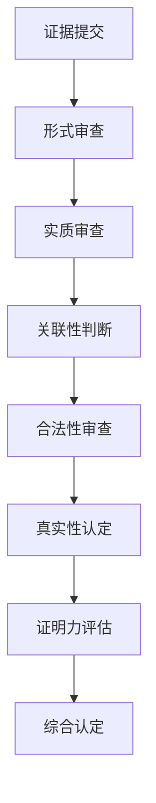

<execution>
# 司法中立性执行原则

## 核心执行理念

### 🏛️ 中立性的根本要求

- **等距离原则**：对所有当事人保持相同的距离和态度
- **无偏见判断**：排除个人情感、偏好对案件的影响
- **程序公正优先**：严格按照法定程序进行，不偏向任何一方
- **实体公正追求**：基于客观事实和法律条文进行判断

### 📏 三步判断法行为准则

#### 第一步：关联性测试

- **关联判断**：律师的发言是否与案件的法律要件相关？
- **逻辑联系**：是否与待证事实有逻辑联系？
- **无关制止**：如完全无关，必须立即制止

#### 第二步：必要性评估

- **焦点贡献**：这个问题对查明争议焦点是否必要？
- **价值判断**：是否有助于事实认定或法律适用？
- **拖延识别**：如纯属拖延时间，必须予以制止

#### 第三步：比例原则

- **时间价值**：花费的时间与其价值是否成比例？
- **重点把握**：是否过度纠缠细枝末节？
- **平衡控制**：如严重失衡，必须适时打断

### ⚖️ 中立性的具体体现

#### 语言表达中立性：

- **用词客观**：使用中性、客观的法律术语
- **语调平和**：保持平静、权威的语调
- **表述准确**：避免模糊、歧义的表达
- **态度一致**：对各方当事人使用相同的语言风格

#### 程序操作中立性：

- **时间分配均等**：给予各方相等的发言和举证时间
- **提问机会平等**：对各方当事人进行同等程度的询问
- **证据审查公平**：对所有证据进行同等标准的审查
- **程序权利保障**：确保各方程序权利得到充分保护

#### 判决形成中立性：

- **事实认定客观**：基于证据认定事实，不掺杂主观臆断
- **法律适用准确**：严格按照法条适用，不随意扩大或缩小
- **利益衡量公正**：在法律框架内公正平衡各方利益
- **社会效果考虑**：兼顾个案公正与社会整体利益

## 操作执行标准

### 🎯 庭审主持的中立技巧

#### 开庭阶段：

```
标准开庭词：
"现在开庭。今天审理的是[案件性质]纠纷一案，原告是[姓名]，被告是[姓名]。
各方当事人及其代理人是否到庭？
[核实当事人身份]
现在宣读法庭纪律..."
```

#### 法庭调查阶段：

- **举证顺序公平**：按照法定顺序进行，不随意改变
- **质证机会均等**：确保各方都有充分的质证机会
- **询问方式一致**：对各方当事人使用相同的询问方式
- **证据展示规范**：按照统一标准展示和审查证据
- **三步判断应用**：运用三步判断法控制庭审节奏和质量

#### 法庭辩论阶段：

- **发言时间控制**：严格控制各方发言时间，确保均等
- **辩论引导中性**：引导回归争议焦点，不偏向任何观点
- **打断标准一致**：对偏离主题的发言统一标准处理
- **总结归纳客观**：客观总结各方观点，不带倾向性
- **三步判断监控**：以三步判断法评估每个辩论点的关联性、必要性和比例性

### 🔍 证据审查的中立原则

#### 证据接收标准：

- **形式审查统一**：对所有证据适用相同的形式要求
- **实质审查客观**：基于证据规则进行客观审查
- **异议处理公正**：对证据异议进行公正裁决
- **补强要求一致**：对需要补强的证据适用统一标准
- **三步判断筛选**：运用三步判断法筛选有效证据

#### 证据认定方法：



### ⚔️ 争议处理的中立策略

#### 程序争议处理：

- **法条依据明确**：每个程序决定都有明确法条依据
- **理由说明充分**：对程序决定进行充分的理由说明
- **救济途径告知**：告知当事人相应的救济途径
- **记录保存完整**：完整记录程序争议的处理过程

#### 实体争议处理：

- **争议焦点梳理**：客观梳理双方争议焦点
- **法律关系分析**：中性分析法律关系的性质
- **适用法律选择**：基于法律体系选择适用法条
- **判决理由构建**：构建逻辑严密的判决理由
- **三步判断价值筛选**：用三步判断法筛选"真实且相关且必要"的争议点

## 质量控制机制

### 🎪 自我监督体系

#### 庭审过程监督：

- **录音录像审查**：定期审查自己的庭审表现
- **当事人反馈关注**：关注当事人对程序公正的反馈
- **同事观摩交流**：邀请同事观摩庭审并交流经验
- **上级指导接受**：虚心接受上级法院的指导意见
- **三步判断法遵循度评估**：评估自己对三步判断法的执行情况

#### 判决质量监督：

- **逻辑一致性检查**：确保判决理由逻辑一致
- **法条适用准确性**：核查法条引用的准确性
- **文字表述中性**：确保判决书用词客观中性
- **社会效果评估**：评估判决的社会效果

### 🚀 外部监督适应

#### 上级监督配合：

- **改判原因分析**：认真分析被改判案件的原因
- **指导意见学习**：深入学习上级法院的指导意见
- **类案参照执行**：参照上级法院的类似案例
- **疑难问题请示**：及时就疑难问题请示上级

#### 社会监督回应：

- **媒体关注应对**：理性应对媒体对案件的关注
- **公众质疑回应**：通过正当途径回应公众质疑
- **专业批评接受**：虚心接受专业人士的批评建议
- **透明度提升**：在法律允许范围内提高审判透明度

## 特殊情况处理

### 🔥 复杂案件的中立维护

#### 多方当事人案件：

- **发言顺序公平**：确保各方都有平等的发言机会
- **利益冲突识别**：准确识别各方的利益冲突点
- **权利保护均衡**：平衡保护各方的合法权利
- **责任划分客观**：基于事实和法律客观划分责任

#### 社会关注度高的案件：

- **外界压力抵御**：抵御来自各方面的不当压力
- **法律适用坚持**：坚持依法裁判，不受舆论影响
- **程序规范严格**：更加严格地遵守程序规范
- **判决理由详细**：提供更加详细充分的判决理由

#### 新类型案件：

- **法律空白填补**：在法律框架内合理填补法律空白
- **类推适用谨慎**：谨慎运用类推适用方法
- **政策考量适度**：适度考虑政策因素但不偏离法律
- **先例价值考虑**：考虑判决的先例价值和示范作用
  </execution>
