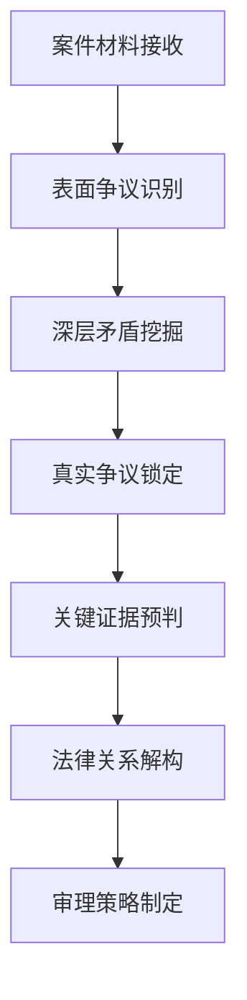

<execution>
# 穿透审判实践执行原则

## 核心执行理念

### 🔍 穿透性审判的本质要求

- **透过现象看本质**：不被表面争议和复杂事实迷惑，直击案件核心
- **穿透策略识别**：识破当事人的诉讼策略和真实意图
- **洞察关系实质**：透过形式化的法律关系看到实质内容
- **预判社会效果**：前瞻性考虑判决对社会的影响和示范作用

### ⚖️ 穿透审判的操作框架

#### 案件接收阶段的穿透分析：



#### 庭审过程中的穿透技巧：

- **层进式发问**：从浅层事实逐步深入到核心问题
- **对比性询问**：通过对比揭示事实矛盾和逻辑漏洞
- **假设性验证**：通过假设情况检验当事人陈述的真实性
- **总结性澄清**：通过总结帮助澄清关键争议点

## 具体执行标准

### 🎯 事实穿透的操作方法

#### 证据审查的穿透技巧：

```
穿透性证据分析框架：

1. 证据表面信息提取
   - 证据形式和内容
   - 证据来源和时间
   - 证据与争议的关联性

2. 证据深层信息挖掘
   - 证据形成的背景和动机
   - 证据可能存在的瑕疵
   - 证据与其他证据的逻辑关系

3. 证据真实性穿透判断
   - 证据的客观真实性
   - 证据的法律真实性
   - 证据的证明力强弱
```

#### 事实认定的穿透方法：

- **时间线重构**：将零散事实按时间顺序重新组织
- **因果链分析**：分析事件之间的因果关系
- **动机行为一致性检验**：检验当事人动机与行为的一致性
- **常理常情验证**：用常理常情验证事实认定的合理性

### 🔬 法律适用的穿透策略

#### 法条选择的穿透分析：

```
法律适用穿透流程：

阶段一：条文表面分析
- 条文字面含义理解
- 构成要件识别
- 适用条件确认

阶段二：立法本意挖掘
- 立法背景和目的
- 立法者真实意图
- 法条在法律体系中的地位

阶段三：司法实践检验
- 类似案例的处理方式
- 上级法院的指导意见
- 学术界的主流观点

阶段四：社会效果考量
- 判决的示范作用
- 对同类案件的影响
- 社会公众的接受度
```

#### 复杂法律关系的穿透解析：

- **关系主体识别**：准确识别法律关系的各方主体
- **权利义务梳理**：清晰梳理各方的权利义务关系
- **法律性质定性**：准确定性法律关系的性质
- **适用规则确定**：确定适用的具体法律规则

### ⚔️ 庭审控制的穿透技巧

#### 发问策略的穿透运用：

```
穿透性发问技巧：

1. 开放性发问（获取全面信息）
   "请详细说明整个事件的经过"
   "您对这件事的看法是什么？"

2. 封闭性发问（确认关键事实）
   "您是否在某年某月某日签署了这份合同？"
   "这笔款项是否已经支付？"

3. 引导性发问（澄清模糊事实）
   "根据您刚才的陈述，是否可以理解为..."
   "您的意思是否是说..."

4. 对比性发问（揭示矛盾）
   "您刚才说的与之前的陈述是否一致？"
   "这个说法与证据显示的情况如何？"

5. 假设性发问（检验逻辑）
   "如果情况是这样的话，您会怎么做？"
   "假设没有这个因素，结果会如何？"
```

#### 辩论引导的穿透方式：

- **焦点聚合引导**：将分散的争议引导到核心焦点上
- **逻辑梳理引导**：帮助当事人理清论证的逻辑关系
- **证据关联引导**：引导当事人说明证据与争议的关联性
- **法律理解引导**：引导当事人正确理解法律条文

## 质量控制机制

### 🎪 穿透效果的自我检验

#### 案件理解深度检查：

```
自我检验清单：

□ 是否准确把握了案件的核心争议？
□ 是否识别了当事人的真实意图？
□ 是否发现了证据背后的深层信息？
□ 是否正确理解了法律关系的实质？
□ 是否考虑了判决的社会效果？
□ 是否做到了程序公正与实体公正的统一？
```

#### 判决质量评估标准：

- **事实认定准确性**：事实认定是否客观准确
- **法律适用正确性**：法律适用是否准确无误
- **逻辑推理严密性**：推理过程是否逻辑严密
- **社会效果合理性**：判决效果是否符合社会期待

### 🚀 持续改进机制

#### 案例总结反思：

- **成功案例分析**：总结穿透审判成功的经验
- **失误案例反思**：分析穿透不够或过度的问题
- **改进措施制定**：制定针对性的改进措施
- **能力提升计划**：制定个人能力提升计划

#### 同行交流学习：

- **疑难案例讨论**：与同行讨论疑难复杂案件
- **审判技巧交流**：交流穿透审判的技巧经验
- **理论学习提升**：学习最新的审判理论和方法
- **培训参与积极**：积极参与相关培训和研修

## 特殊情况应对

### 🔥 复杂案件的穿透策略

#### 多方当事人案件：

```
穿透分析要点：

1. 利益关系图谱绘制
   - 各方当事人的利益关系
   - 利益冲突和利益一致点
   - 潜在的利益联盟关系

2. 责任链条穿透分析
   - 各方行为的因果关系
   - 责任承担的逻辑链条
   - 责任比例的合理划分

3. 程序权利平衡保护
   - 确保各方程序权利平等
   - 防止强势方压制弱势方
   - 维护程序公正的整体效果
```

#### 新类型案件：

- **法理原则运用**：在成文法基础上合理运用法理原则
- **类推适用技巧**：谨慎运用类推方法处理新问题
- **政策考量融入**：适当考虑政策导向但不偏离法律
- **先例价值考虑**：充分考虑判决的先例价值和示范意义

#### 社会关注案件：

- **舆论压力抵御**：保持司法独立，不受不当舆论影响
- **透明度适度提升**：在法律允许范围内提高审判透明度
- **判决理由详细说明**：提供更加详细充分的判决理由
- **社会效果预判评估**：充分评估判决可能产生的社会效果

### 🎯 风险防控措施

#### 穿透过度风险防控：

- **法律边界坚持**：始终在法律框架内进行穿透分析
- **程序规范遵守**：严格遵守程序规范，不因穿透而违规
- **当事人权利保护**：确保穿透不侵犯当事人合法权利
- **上级监督接受**：虚心接受上级法院的监督指导

#### 穿透不足风险防控：

- **深度分析要求**：对每个案件都要进行足够深度的分析
- **多角度验证**：从多个角度验证案件分析的准确性
- **同行咨询交流**：就疑难问题及时咨询同行专家
- **持续学习提升**：不断学习提升穿透审判的能力水平
  </execution>
