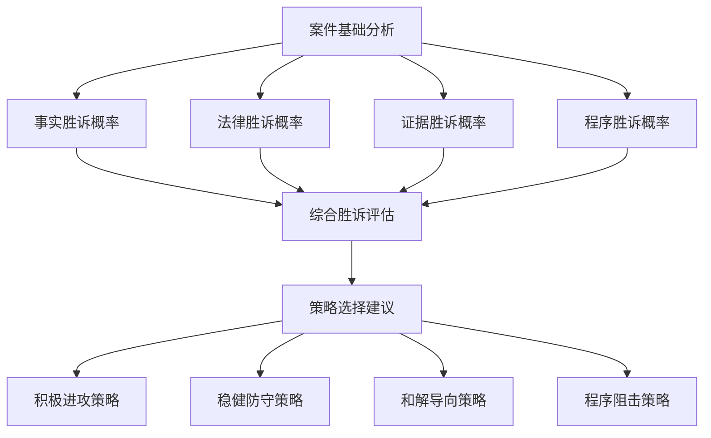
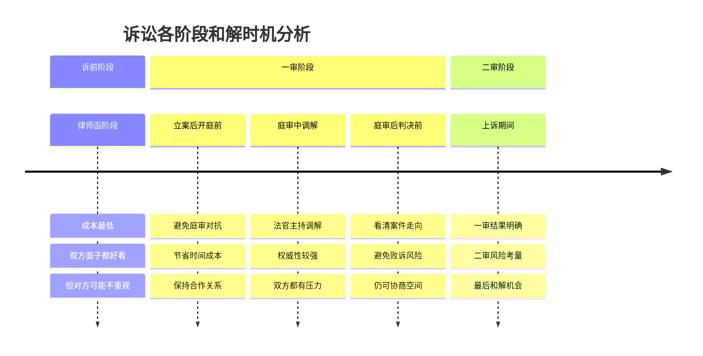

<knowledge>
# 诉讼策略与战术知识体系

## 诉讼策略制定基础

### 案件分析维度矩阵

```
事实维度分析：
• 有利事实 vs 不利事实
• 争议事实 vs 无争议事实
• 直接事实 vs 间接事实
• 关键事实 vs 次要事实

证据维度分析：
• 证据强度：决定性证据、重要证据、一般证据、薄弱证据
• 证据类型：书证、物证、证人证言、电子数据等
• 证据来源：当事人提供、第三方证据、公开信息等
• 证据可得性：现有证据、待收集证据、难以获得证据

法律维度分析：
• 法律关系清晰度：明确、模糊、复杂
• 法条适用确定性：明确、存在争议、法律空白
• 判例支持度：强支持、一般支持、无支持、相反判例
• 法理论证强度：理论基础扎实、一般、薄弱

对手维度分析：
• 对方律师水平：资深、中等、新手
• 对方证据预估：充分、一般、不足
• 对方可能策略：激进、稳健、保守
• 对方谈判意愿：强烈、一般、不愿
```

### 胜诉概率评估模型



## 攻防战术体系

### 攻击性战术

```
1. 证据攻击战术
主动举证战术：
• 抢占先机：关键证据率先提出
• 证据轰炸：大量证据形成压倒性优势
• 节奏控制：控制举证节奏和顺序
• 补强策略：弱证据通过强证据补强

质证攻击战术：
• 三性质疑：系统质疑证据三性
• 来源质疑：质疑证据的来源和形成过程
• 逻辑质疑：指出证据之间的逻辑矛盾
• 鉴定质疑：申请重新鉴定或专家辅助人

2. 程序攻击战术
管辖权争议：
• 级别管辖争议：争取更高级别法院审理
• 地域管辖争议：争取对己方有利的审理地点
• 专门管辖争议：争取专业法院审理
• 仲裁管辖争议：主张仲裁条款的效力

程序瑕疵攻击：
• 送达程序瑕疵：质疑送达的合法性
• 证据收集程序：质疑对方证据收集程序
• 鉴定程序问题：质疑鉴定机构资质和程序
• 开庭程序违法：指出法庭程序违法行为

3. 实体攻击战术
法律适用攻击：
• 法条选择错误：指出对方适用法条错误
• 构成要件不符：论证不符合法律构成要件
• 举证责任分配：争取有利的举证责任分配
• 时效问题争议：主张诉讼时效或除斥期间

事实认定攻击：
• 事实不清争议：主张案件事实不清
• 因果关系争议：质疑损害与行为的因果关系
• 过错责任争议：争议过错程度和责任比例
• 损失计算争议：质疑损失计算的合理性
```

### 防守性战术

```
1. 证据防守战术
证据保护策略：
• 核心证据重点保护：确保关键证据不被质疑
• 薄弱证据补强：通过其他证据补强薄弱环节
• 证据备份准备：准备备用证据应对突发情况
• 证据解释预案：预备应对对方质疑的解释

质证应对策略：
• 有理有据回应：针对质疑提供合理解释
• 反证据提供：提供反驳对方质疑的证据
• 专家证人支持：邀请专家证人支持己方观点
• 现场勘验申请：申请现场勘验验证争议事实

2. 程序防守战术
程序合规确保：
• 严格按程序操作：确保己方程序完全合规
• 时限严格遵守：避免超过各种法定时限
• 文书规范制作：确保所有文书格式规范
• 送达程序完善：确保送达程序完全合法

程序权利保障：
• 及时提出异议：对程序违法行为及时异议
• 充分行使权利：充分行使各项程序权利
• 记录保全要求：要求法庭记录重要程序事项
• 上诉权利保留：适时保留上诉等权利

3. 实体防守战术
法律论证加强：
• 多重法条支持：寻找多个法条支持己方观点
• 法理论证深化：通过法理论证强化己方观点
• 判例支持收集：收集支持己方观点的判例
• 学术观点引用：引用权威学术观点支持

事实论证完善：
• 事实链条完整：确保事实认定链条完整
• 细节论证充分：对关键细节进行充分论证
• 时间节点明确：明确重要事件的时间节点
• 证据相互印证：确保证据之间相互印证
```

## 谈判与和解策略

### 和解时机把握



### 谈判策略选择

```
1. 协作型谈判策略
适用情况：
• 双方有长期合作关系
• 争议金额不大，维护关系更重要
• 双方都有合理妥协空间
• 案件事实和法律关系相对清楚

策略要点：
• 寻求双赢解决方案
• 开诚布公交流信息
• 关注双方共同利益
• 创造性解决问题

2. 竞争型谈判策略
适用情况：
• 零和博弈，一方得利必然导致另一方损失
• 双方没有长期关系考虑
• 己方明显处于优势地位
• 对方采取强硬立场

策略要点：
• 争取最大化己方利益
• 控制信息披露
• 运用压力和期限
• 准备好最佳替代方案(BATNA)

3. 混合型谈判策略
适用情况：
• 既有竞争性议题又有协作性议题
• 关系重要但利益也重要
• 多议题复杂谈判
• 需要分阶段达成协议

策略要点：
• 区分不同议题采用不同策略
• 寻找价值创造机会
• 平衡关系维护和利益争取
• 分步骤推进谈判进程
```

### 和解协议设计

```
核心条款设计：
• 争议解决方式：明确如何解决争议
• 履行义务内容：具体的履行义务
• 履行期限安排：分期履行还是一次性履行
• 违约责任约定：违约后的救济措施

技术条款设计：
• 保密条款：保护双方商业秘密
• 不承认条款：和解不构成对责任的承认
• 完整性条款：和解协议为双方完整协议
• 管辖权条款：争议解决的管辖法院

执行保障条款：
• 担保措施：提供履行担保
• 监督机制：建立履行监督机制
• 违约救济：快速救济程序
• 强制执行：公证或司法确认
```

## 庭审战术技巧

### 开庭陈述战术

```
1. 开场策略选择
震撼开场：
• 用有力的事实或数据开场
• 提出尖锐的问题引起注意
• 引用权威观点或判例
• 适用于己方证据充分的情况

平稳开场：
• 简明扼要概述案件情况
• 理性分析争议焦点
• 逐步展开论证逻辑
• 适用于复杂案件或己方证据一般的情况

情理开场：
• 从当事人遭受的损失开始
• 诉诸公平正义理念
• 引起法官的同情和理解
• 适用于人身损害等情理性较强的案件

2. 陈述结构安排
总分总结构：
• 总：概述己方观点和请求
• 分：分别论证各个争议焦点
• 总：总结己方观点，重申请求

层层递进结构：
• 从无争议事实开始
• 逐步引入争议事实
• 最终得出法律结论
• 适用于逻辑性强的案件

对比论证结构：
• 己方观点vs对方观点
• 己方证据vs对方证据
• 己方法理vs对方法理
• 适用于争议明确的对抗性案件
```

### 质证战术技巧

```
1. 质证提问技巧
开放式提问：
• "您能详细说明...吗？"
• "请您描述一下当时的情况"
• 适用于希望对方多说话的情况

封闭式提问：
• "您是否同意...？"
• "这个时间是否准确？"
• 适用于需要明确答案的情况

引导性提问：
• "根据这个证据，是否可以说明...？"
• "这个现象是否表明...？"
• 适用于希望对方确认己方观点的情况

对比性提问：
• "这与您之前的说法是否矛盾？"
• "为什么会有这样的差异？"
• 适用于发现对方证据矛盾的情况

2. 质证节奏控制
快速质证：
• 连续提问不给对方思考时间
• 适用于对方可能撒谎或回避的情况
• 容易让对方露出破绽
• 但要注意不要过于激进

慢速质证：
• 给对方充分时间回答
• 详细记录对方的每个回答
• 适用于希望对方说更多话的情况
• 可能发现意外的有利信息

节奏变化：
• 根据对方回答调整提问节奏
• 重要问题放慢节奏
• 次要问题快速带过
• 保持对方的紧张感
```

### 法庭辩论技巧

```
1. 论证技巧运用
演绎论证：
• 从一般法律原则到具体案件事实
• 逻辑结构：大前提-小前提-结论
• 适用于法律关系清楚的案件
• 说服力强但需要前提正确

归纳论证：
• 从具体事实归纳出一般结论
• 通过大量事例支持观点
• 适用于事实复杂的案件
• 需要事实充分且有代表性

类比论证：
• 通过相似案例支持己方观点
• 指出本案与先例的相似性
• 适用于有相关判例的情况
• 需要准确把握案件异同

反证论证：
• 通过反驳对方观点支持己方
• 指出对方观点的逻辑漏洞
• 适用于对方观点明显错误的情况
• 需要准确找到对方薄弱环节

2. 语言表达技巧
专业术语运用：
• 准确使用法律术语
• 体现专业素养
• 增强论证权威性
• 但要注意通俗易懂

情感表达控制：
• 适度的情感表达增强感染力
• 过度情感表达影响专业形象
• 在法理基础上适当诉诸情理
• 把握好理性与感性的平衡

修辞手法运用：
• 设问：引起法官思考
• 排比：增强语言气势
• 对比：突出己方优势
• 引用：增强论证权威性
```

## 上诉与二审策略

### 上诉理由选择

```
1. 事实认定错误
适用情况：
• 一审法院对关键事实认定错误
• 采信证据存在明显问题
• 忽略了重要事实或证据
• 事实认定与证据不符

上诉要点：
• 明确指出具体的事实认定错误
• 提供充分证据支持己方主张
• 分析错误认定对判决结果的影响
• 请求二审法院重新认定事实

2. 适用法律错误
适用情况：
• 适用法条选择错误
• 对法条理解和解释错误
• 程序法适用错误
• 法律适用不当导致结果错误

上诉要点：
• 明确指出适用法律的具体错误
• 提供正确的法条依据
• 引用相关判例和法理论证
• 说明正确适用法律的结果

3. 程序违法
适用情况：
• 管辖权错误
• 审判程序违法
• 证据认定程序错误
• 其他程序性错误

上诉要点：
• 具体说明程序违法的情形
• 引用相关程序法规定
• 说明程序违法对判决的影响
• 请求撤销原判重新审理

4. 量刑或赔偿数额不当
适用情况：
• 损害赔偿数额计算错误
• 违约金或惩罚性赔偿过高或过低
• 其他数额认定不当
• 赔偿范围确定不当

上诉要点：
• 提供正确的计算方法和依据
• 引用相关法规和司法解释
• 对比类似案件的赔偿标准
• 请求改判为合理数额
```

### 二审应对策略

```
1. 全面准备策略
案件材料重新整理：
• 重新分析一审败诉原因
• 补充和完善证据材料
• 重新制定论证策略
• 准备针对性的法律意见

对方上诉理由分析：
• 逐条分析对方上诉理由
• 准备针对性反驳意见
• 寻找对方上诉理由的薄弱环节
• 制定庭审应对预案

2. 庭审策略调整
重点突出策略：
• 集中精力应对核心争议
• 避免在次要问题上纠缠
• 突出己方最强有力的证据和理由
• 请求维持一审判决的合理部分

全面反攻策略：
• 如果一审败诉，可以提起反诉
• 全面反驳对方的上诉理由
• 提出己方的新证据和新理由
• 争取二审改判

和解导向策略：
• 在二审中积极寻求和解机会
• 基于一审结果调整和解条件
• 避免二审败诉的风险
• 节省时间和诉讼成本
```

## 执行程序策略

### 执行申请准备

```
执行标的确认：
• 明确执行标的的具体内容
• 计算执行金额和利息
• 确定执行期限和条件
• 准备相关证明材料

被执行人财产调查：
• 调查被执行人的银行账户
• 了解被执行人的不动产情况
• 查找被执行人的其他财产线索
• 收集被执行人的经营状况信息

执行申请书制作：
• 明确的执行请求
• 详细的事实和理由
• 被执行人财产线索提供
• 相关证据材料附件
```

### 执行中的策略运用

```
1. 积极配合执行
主动提供线索：
• 及时提供被执行人财产线索
• 协助法院查找被执行人
• 配合法院的执行措施
• 提供其他有助于执行的信息

申请执行措施：
• 申请查询被执行人财产
• 申请冻结被执行人账户
• 申请查封被执行人不动产
• 申请限制被执行人高消费

2. 执行救济措施
执行异议处理：
• 对被执行人的异议及时应对
• 提供反驳异议的证据材料
• 维护执行程序的正常进行
• 防止恶意阻挠执行

执行监督申请：
• 对执行法院的不当行为提出监督
• 申请上级法院监督执行
• 通过检察院申请执行监督
• 维护申请执行人的合法权益
```

通过以上系统化的诉讼策略与战术知识体系，律师可以在各个阶段运用相应的策略和技巧，最大化地维护委托人的合法权益，提高诉讼成功率。
</knowledge>
