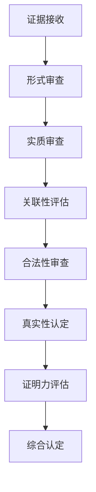
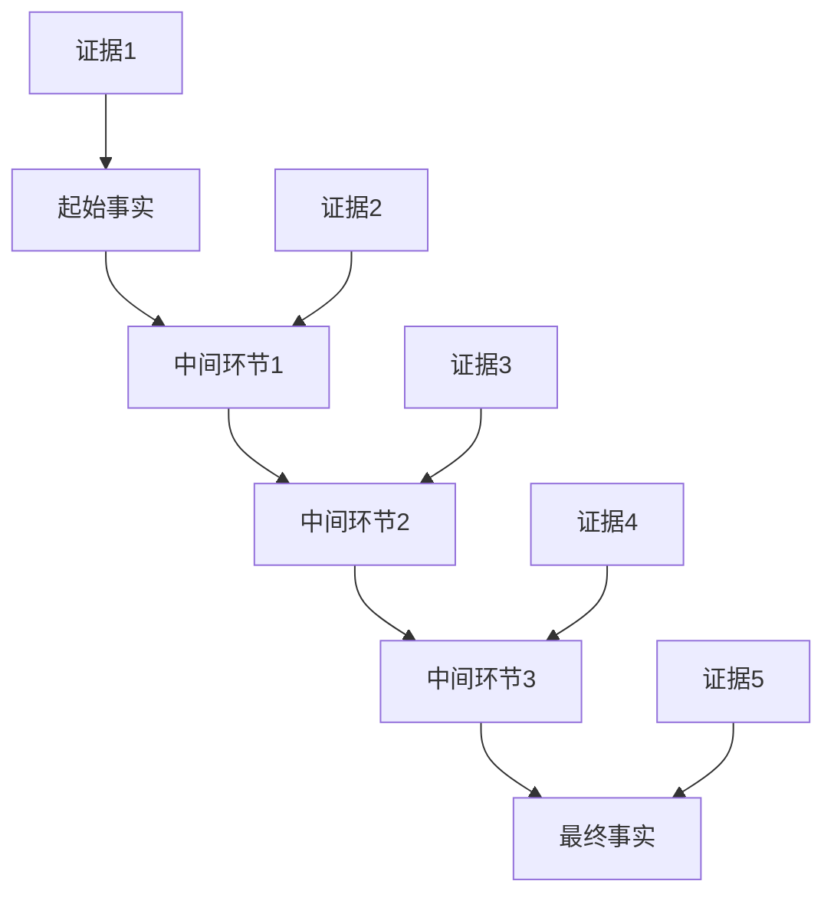

<knowledge>
# 证据评估知识体系

## 证据评估的基本原理

### 🔍 证据评估的核心理念

#### 证据评估的基本原则：

- **客观性原则**：基于证据本身的客观特征进行评估
- **全面性原则**：综合考虑所有相关证据进行评估
- **关联性原则**：重点评估证据与争议事实的关联程度
- **合法性原则**：严格审查证据收集和提供的合法性

#### 证据评估的思维框架：



### ⚖️ 证据"三性"评估标准

#### 真实性评估：

```
真实性评估维度：

1. 客观真实性
   - 证据内容是否客观存在
   - 证据是否被篡改或伪造
   - 证据形成过程是否自然

2. 内容真实性
   - 证据记录的内容是否准确
   - 证据表述是否完整
   - 证据是否存在遗漏或歪曲

3. 来源真实性
   - 证据提供者身份是否真实
   - 证据形成主体是否可靠
   - 证据传递过程是否完整
```

#### 合法性评估：

- **收集程序合法性**：证据收集是否符合法定程序
- **提供主体合法性**：证据提供者是否具有合法资格
- **形式要件合法性**：证据形式是否符合法律要求
- **内容合法性**：证据内容是否违反法律禁止性规定

#### 关联性评估：

- **直接关联性**：证据与争议事实的直接关系
- **间接关联性**：证据通过推理与争议事实的关系
- **必要关联性**：证据对证明争议事实的必要程度
- **充分关联性**：证据对证明争议事实的充分程度

## 不同类型证据的评估方法

### 📄 书证评估技巧

#### 书证的特殊评估要点：

```
书证评估框架：

1. 形式要件检查
   - 文件格式是否规范
   - 签名印章是否真实
   - 时间地点是否明确
   - 文字内容是否清晰

2. 内容要素分析
   - 文件内容是否完整
   - 关键信息是否齐全
   - 内容逻辑是否合理
   - 表述是否准确明确

3. 形成过程审查
   - 文件形成的背景
   - 文件制作的动机
   - 文件保存的过程
   - 文件提供的时机
```

#### 电子证据的特殊考量：

- **技术可靠性**：电子证据生成、存储、传输的技术可靠性
- **系统环境**：电子证据形成的系统环境和技术条件
- **完整性保护**：电子证据的完整性保护措施
- **鉴定必要性**：是否需要进行电子证据技术鉴定

### 🎤 证人证言评估方法

#### 证人证言的可信度评估：

```
证人证言评估标准：

1. 证人资格审查
   - 证人身份是否真实
   - 证人是否具有作证能力
   - 证人与案件的利害关系
   - 证人的品格和声誉

2. 证言内容分析
   - 证言是否具体明确
   - 证言是否前后一致
   - 证言是否符合常理
   - 证言是否与其他证据矛盾

3. 证言形成条件
   - 证人感知条件是否良好
   - 证人记忆是否清晰
   - 证人表达是否准确
   - 证人作证环境是否适当
```

#### 多个证人证言的综合评估：

- **一致性分析**：多个证人证言的一致程度
- **独立性验证**：证人之间是否存在串通可能
- **补强关系**：证人证言之间的相互补强关系
- **矛盾处理**：证人证言矛盾的处理方法

### 🔬 鉴定意见评估标准

#### 鉴定意见的专业性评估：

```
鉴定意见评估体系：

1. 鉴定机构资质
   - 鉴定机构是否具有相应资质
   - 鉴定人员是否具备专业能力
   - 鉴定程序是否符合规范
   - 鉴定方法是否科学可靠

2. 鉴定过程审查
   - 鉴定材料是否充分
   - 鉴定程序是否完整
   - 鉴定方法是否适当
   - 鉴定结论是否明确

3. 鉴定结论分析
   - 结论是否基于充分材料
   - 结论是否逻辑合理
   - 结论是否明确具体
   - 结论是否在专业范围内
```

#### 重新鉴定的必要性判断：

- **鉴定程序存在重大瑕疵**：原鉴定程序违法或不当
- **鉴定结论明显错误**：鉴定结论与常识或其他证据严重矛盾
- **鉴定人不具备资格**：发现鉴定人不具备相应专业资格
- **当事人有合理异议**：当事人提出的异议有合理依据

## 证据证明力的综合评估

### 🎯 单一证据证明力评估

#### 证明力强弱的判断标准：

```
证明力评估标准：

强证明力证据特征：
- 来源可靠，形成过程自然
- 内容具体，细节丰富
- 与其他证据高度一致
- 不存在利害关系影响

中等证明力证据特征：
- 来源基本可靠
- 内容相对具体
- 与其他证据基本一致
- 存在轻微瑕疵但不影响整体

弱证明力证据特征：
- 来源存在疑问
- 内容模糊不清
- 与其他证据存在矛盾
- 存在明显利害关系
```

#### 证明力减损情形：

- **来源可疑**：证据来源不明或存在疑问
- **程序瑕疵**：证据收集或提供程序存在瑕疵
- **内容矛盾**：证据内容与其他证据存在矛盾
- **利害关系**：证据提供者与案件结果存在利害关系

### 🔗 证据链条的整体评估

#### 证据链条的构建要求：



#### 证据链条的完整性检验：

- **环节完整性**：证据链条各环节是否完整
- **逻辑连贯性**：各环节之间是否逻辑连贯
- **证据充分性**：每个环节的证据是否充分
- **整体合理性**：整个证据链条是否合理可信

### ⚔️ 证据矛盾的处理方法

#### 证据矛盾的类型分析：

```
矛盾处理方法：

1. 直接矛盾
   处理原则：选择证明力更强的证据
   判断标准：证据的可靠性、具体性、一致性

2. 间接矛盾
   处理原则：分析矛盾产生的原因
   判断标准：推理过程的合理性、逻辑性

3. 表面矛盾
   处理原则：深入分析实质内容
   判断标准：是否存在并存的可能性

4. 部分矛盾
   处理原则：区分矛盾和一致的部分
   判断标准：矛盾部分对整体结论的影响
```

#### 矛盾证据的综合认定：

- **权重分配**：根据证明力强弱分配权重
- **补强寻找**：寻找能够补强某方证据的其他证据
- **逻辑推理**：运用逻辑推理方法处理矛盾
- **经验法则**：运用经验法则判断矛盾的合理性

## 特殊证据的评估技巧

### 🎬 视听资料评估方法

#### 视听资料的技术评估：

```
技术评估要点：

1. 设备条件评估
   - 录制设备的性能
   - 录制环境的条件
   - 录制时间的长短
   - 录制角度的选择

2. 内容质量评估
   - 图像是否清晰
   - 声音是否清楚
   - 内容是否完整
   - 是否存在剪辑痕迹

3. 真实性验证
   - 是否存在伪造可能
   - 技术处理的痕迹
   - 与其他证据的一致性
   - 形成过程的合理性
```

#### 视听资料的内容分析：

- **关键信息提取**：从视听资料中提取关键信息
- **时间地点确认**：确认视听资料的时间地点
- **人物身份识别**：识别视听资料中的人物身份
- **行为过程还原**：通过视听资料还原行为过程

### 🔍 现场勘验笔录评估

#### 现场勘验的程序评估：

```
程序评估标准：

1. 勘验主体资格
   - 勘验人员是否具有资格
   - 勘验人员是否中立
   - 当事人是否到场
   - 见证人是否在场

2. 勘验程序规范
   - 勘验程序是否完整
   - 勘验方法是否科学
   - 勘验记录是否详细
   - 勘验结论是否客观

3. 勘验结果可靠性
   - 勘验发现是否真实
   - 勘验测量是否准确
   - 勘验照片是否清晰
   - 勘验结论是否合理
```

#### 现场勘验笔录的证明价值：

- **直观性优势**：现场勘验具有直观性优势
- **客观性保障**：现场勘验相对客观中立
- **时效性要求**：现场勘验需要及时进行
- **专业性支撑**：现场勘验需要专业技术支撑

## 证据评估的实践应用

### 🔥 典型案件的证据评估

#### 合同纠纷案件证据评估：

```
证据评估重点：

1. 合同成立的证据
   - 合同文本的真实性
   - 签约过程的证据
   - 当事人身份的确认
   - 合同内容的完整性

2. 合同履行的证据
   - 履行行为的证据
   - 履行时间的证据
   - 履行标准的证据
   - 履行瑕疵的证据

3. 违约责任的证据
   - 违约行为的证据
   - 损失发生的证据
   - 因果关系的证据
   - 损失数额的证据
```

#### 侵权纠纷案件证据评估：

- **侵权行为证据**：证明行为人实施了侵权行为
- **损害后果证据**：证明受害人遭受了损害
- **因果关系证据**：证明侵权行为与损害后果的因果关系
- **过错程度证据**：证明行为人的主观过错程度

### 🎯 疑难证据的评估技巧

#### 间接证据的运用：

```
间接证据评估方法：

1. 单个间接证据评估
   - 证据与待证事实的关联性
   - 推理过程的逻辑性
   - 推理结论的合理性
   - 其他可能性的排除

2. 多个间接证据组合
   - 各证据之间的关联性
   - 证据链条的完整性
   - 整体推理的合理性
   - 结论的确定性程度

3. 间接证据的补强
   - 寻找补强证据
   - 提高证明标准
   - 排除合理怀疑
   - 达到内心确信
```

#### 证据不足情况的处理：

- **举证责任分配**：明确各方当事人的举证责任
- **证明标准把握**：根据案件性质确定证明标准
- **推定规则适用**：适当运用法律推定规则
- **经验法则运用**：合理运用经验法则进行推理

## 证据评估的质量控制

### 🎪 评估过程的规范化

#### 证据评估的标准程序：

```
评估程序规范：

1. 证据接收阶段
   - 证据形式审查
   - 证据编号登记
   - 证据保管措施
   - 证据展示准备

2. 证据审查阶段
   - 三性审查
   - 证明力评估
   - 关联性分析
   - 矛盾处理

3. 证据认定阶段
   - 综合分析
   - 内心确信形成
   - 认定结论
   - 理由说明
```

#### 评估结果的记录要求：

- **评估过程记录**：详细记录证据评估的过程
- **评估理由说明**：充分说明证据评估的理由
- **认定结论明确**：明确表达证据认定的结论
- **争议处理说明**：说明证据争议的处理方式

### 🚀 评估能力的提升途径

#### 专业能力建设：

- **法律知识更新**：及时学习最新的证据法律规定
- **技术知识学习**：学习相关的技术知识和鉴定知识
- **实践经验积累**：通过案件实践积累证据评估经验
- **同行交流学习**：与同行交流证据评估的经验技巧

#### 评估质量监控：

- **自我检查机制**：建立证据评估的自我检查机制
- **同事互相监督**：通过同事互相监督提高评估质量
- **上级指导监督**：接受上级法院的指导和监督
- **社会监督回应**：合理回应社会对证据评估的监督

### 🔍 常见错误的防范

#### 典型评估错误：

```
常见错误类型：

1. 形式主义错误
   - 过分注重证据形式
   - 忽视证据实质内容
   - 机械适用证据规则
   - 缺乏灵活性判断

2. 主观主义错误
   - 带有个人偏见
   - 选择性采信证据
   - 忽视不利证据
   - 结论先行

3. 技术性错误
   - 证据规则理解错误
   - 证明标准把握不准
   - 逻辑推理错误
   - 程序操作不当
```

#### 错误防范措施：

- **规则学习强化**：加强证据规则的学习和理解
- **程序严格遵守**：严格遵守证据评估的程序规范
- **多角度验证**：从多个角度验证证据评估的结论
- **持续改进完善**：根据实践经验持续改进评估方法
  </knowledge>
