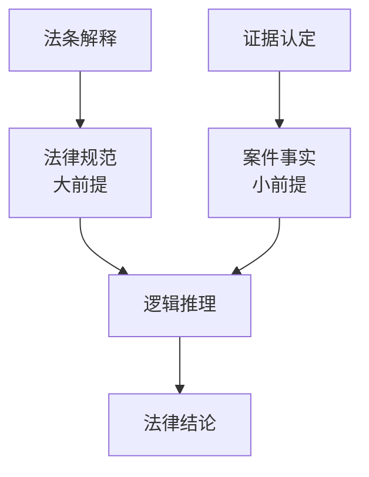
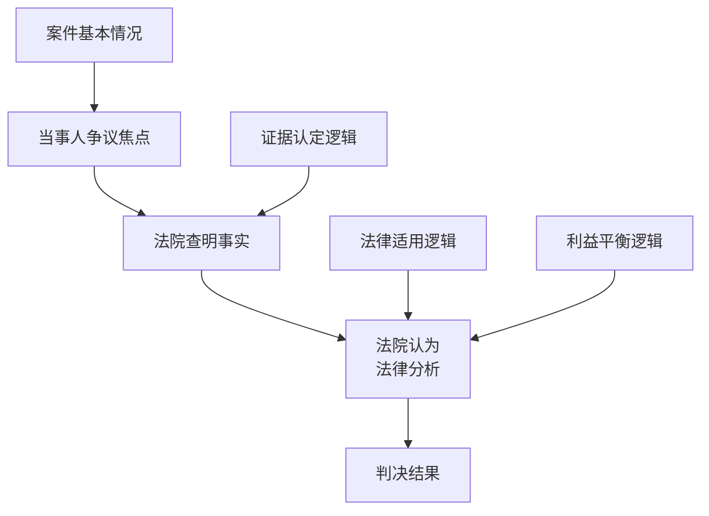

<knowledge>
# 司法逻辑知识体系

## 司法推理的逻辑基础

### 🧠 司法逻辑的核心特征

#### 与一般逻辑的区别：

- **规范性导向**：以法律规范为推理的大前提
- **证据约束性**：推理必须基于法庭认定的证据
- **程序限制性**：推理过程受到程序法的严格限制
- **价值判断融入**：在逻辑推理中融入法律价值判断

#### 司法推理的基本模式：



### ⚖️ 三段论在司法中的应用

#### 标准三段论结构：

```
大前提：法律条文规定的抽象规范
小前提：经过证据认定的具体案件事实
结论：基于法律适用得出的判决结果

示例：
大前提：《合同法》规定，当事人一方不履行合同义务的，应当承担违约责任
小前提：被告某公司未按约定时间交付货物（经证据认定的事实）
结论：被告某公司应当承担违约责任
```

#### 复杂三段论的处理：

- **多重三段论**：复杂案件需要多个三段论的组合
- **选择性三段论**：存在多个可能适用条文时的选择
- **补强性三段论**：用于补强主要推理的辅助推理
- **反驳性三段论**：用于反驳对方观点的推理

## 证据逻辑分析体系

### 🔍 证据的逻辑审查方法

#### 单一证据的逻辑审查：

```
证据逻辑审查维度：

1. 内在逻辑一致性
   - 证据内容是否前后一致
   - 证据各部分是否相互矛盾
   - 证据表述是否符合逻辑

2. 外在逻辑关联性
   - 证据与待证事实的逻辑关系
   - 证据与其他证据的逻辑关系
   - 证据与常理常情的符合度

3. 形成逻辑合理性
   - 证据形成的时间逻辑
   - 证据形成的因果逻辑
   - 证据保存的连续逻辑
```

#### 证据链的逻辑构建：

- **时间逻辑链**：按时间顺序排列证据，形成事件发展脉络
- **因果逻辑链**：按因果关系连接证据，证明事件因果关系
- **主次逻辑链**：区分主要证据和辅助证据的逻辑关系
- **互证逻辑链**：多个证据相互印证形成的逻辑关系

### 🎯 证据矛盾的逻辑分析

#### 证据矛盾的类型识别：

```
矛盾类型分析框架：

1. 直接矛盾（A与非A）
   - 两个证据对同一事实的相反认定
   - 处理方式：选择证明力更强的证据

2. 间接矛盾（逻辑推导矛盾）
   - 两个证据推导出的结论相互矛盾
   - 处理方式：分析推导过程的合理性

3. 表面矛盾（实质不矛盾）
   - 表面看似矛盾但实质可以并存
   - 处理方式：深入分析证据的具体内容

4. 条件矛盾（在特定条件下矛盾）
   - 在特定条件或时间下的矛盾
   - 处理方式：明确矛盾的具体条件
```

#### 矛盾证据的处理原则：

- **证明力比较原则**：选择证明力更强的证据
- **综合认定原则**：结合全案证据进行综合认定
- **补强证据原则**：寻找补强证据解决矛盾
- **存疑有利原则**：在无法确定时适用存疑有利原则

## 法律适用的逻辑方法

### 📚 法条解释的逻辑技巧

#### 解释方法的逻辑运用：

```
法条解释逻辑体系：

1. 文义解释（字面含义分析）
   逻辑要求：严格按照条文字面含义理解
   适用场景：条文含义清楚明确的情况
   逻辑风险：过分拘泥于字面含义可能偏离立法本意

2. 体系解释（法条关联分析）
   逻辑要求：在整个法律体系中理解条文含义
   适用场景：单个条文含义不够清楚的情况
   逻辑风险：可能扩大或缩小条文的适用范围

3. 目的解释（立法目的分析）
   逻辑要求：根据立法目的理解条文含义
   适用场景：条文含义存在争议的情况
   逻辑风险：可能偏离条文的字面含义

4. 历史解释（立法背景分析）
   逻辑要求：根据立法背景和历史理解条文
   适用场景：新旧法衔接或法条变迁的情况
   逻辑风险：可能不适应现实情况的变化
```

#### 法条竞合的逻辑处理：

- **特别法优于一般法**：在特别法和一般法竞合时的选择逻辑
- **新法优于旧法**：在新旧法律竞合时的选择逻辑
- **上位法优于下位法**：在不同效力等级法律竞合时的选择逻辑
- **具体条文优于原则条文**：在具体条文和原则条文竞合时的选择逻辑

### 🔬 类推适用的逻辑规则

#### 类推适用的逻辑条件：

```
类推适用逻辑框架：

前提条件：
1. 存在法律漏洞（现有法条无法直接适用）
2. 存在相似情况（新情况与现有规定的情况相似）
3. 具有同等理由（适用相同法律后果的理由相同）

逻辑过程：
1. 确认法律漏洞的存在
2. 寻找最相似的法律规定
3. 分析相似性的本质特征
4. 判断是否具有同等处理理由
5. 适用相似法条的规定

风险控制：
1. 严格限制类推适用的范围
2. 确保类推的逻辑合理性
3. 考虑类推适用的社会效果
4. 接受上级法院的监督指导
```

## 判决形成的逻辑体系

### 🎪 判决理由的逻辑构建

#### 判决书逻辑结构：



#### 事实认定部分的逻辑要求：

- **证据与事实的对应关系**：每个认定事实都要有相应证据支撑
- **证据采信的理由说明**：说明采信或不采信证据的逻辑理由
- **事实认定的逻辑链条**：事实认定之间要有清晰的逻辑关系
- **争议事实的重点论证**：对争议事实进行重点逻辑论证

#### 法律适用部分的逻辑要求：

- **法条选择的逻辑依据**：说明选择特定法条的逻辑理由
- **构成要件的逻辑分析**：逐一分析法条构成要件的符合性
- **法律后果的逻辑推导**：从构成要件符合性推导出法律后果
- **特殊情况的逻辑处理**：对特殊情况进行专门的逻辑分析

### 🚀 复杂案件的逻辑处理

#### 多争议焦点案件：

```
逻辑处理方法：

1. 争议焦点的逻辑排序
   - 按照逻辑关系排列争议焦点
   - 先处理基础性争议，再处理衍生性争议
   - 明确各争议焦点之间的逻辑关系

2. 分层次逻辑论证
   - 对每个争议焦点进行独立论证
   - 处理各争议焦点之间的逻辑关系
   - 形成整体一致的逻辑结论

3. 综合平衡考量
   - 考虑各争议焦点处理结果的协调性
   - 确保整体判决的逻辑一致性
   - 平衡各方当事人的合法权益
```

#### 新类型案件的逻辑处理：

- **法律原则的逻辑运用**：在成文法基础上运用法律原则的逻辑
- **类推适用的逻辑控制**：严格控制类推适用的逻辑条件
- **政策考量的逻辑融入**：合理融入政策考量但不偏离法律逻辑
- **先例价值的逻辑考量**：考虑判决的先例价值和逻辑示范作用

## 逻辑错误的识别与纠正

### 🔍 常见逻辑错误类型

#### 形式逻辑错误：

```
典型错误类型：

1. 大前提错误
   - 法条理解错误
   - 法条适用范围错误
   - 法条选择错误

2. 小前提错误
   - 事实认定错误
   - 证据采信错误
   - 事实与法条要件不符

3. 推理过程错误
   - 推理步骤缺失
   - 推理逻辑跳跃
   - 推理结论不当
```

#### 非形式逻辑错误：

- **循环论证**：用结论证明前提，用前提证明结论
- **虚假两难**：将复杂问题简化为非此即彼的选择
- **滑坡谬误**：认为一个事件必然导致一系列不良后果
- **稻草人谬误**：歪曲对方观点后进行攻击

### 🎯 逻辑错误的纠正方法

#### 自我检查机制：

```
逻辑自查清单：

□ 大前提（法条）是否选择正确？
□ 小前提（事实）是否认定准确？
□ 推理过程是否逻辑严密？
□ 结论是否与前提相符？
□ 整体逻辑是否前后一致？
□ 是否存在逻辑跳跃？
□ 是否存在循环论证？
□ 是否考虑了反面观点？
```

#### 外部检验机制：

- **同事讨论验证**：与同事讨论复杂案件的逻辑问题
- **上级指导接受**：虚心接受上级法院的逻辑指导
- **专业培训参与**：参与逻辑推理相关的专业培训
- **理论学习加强**：加强逻辑学和法理学的理论学习

## 司法逻辑的实践应用

### 🔥 典型案例的逻辑分析

#### 合同纠纷案件：

```
逻辑分析框架：

1. 合同成立的逻辑分析
   - 要约与承诺的逻辑关系
   - 合同成立时间的逻辑确定
   - 合同内容的逻辑确认

2. 合同履行的逻辑分析
   - 履行义务的逻辑顺序
   - 履行标准的逻辑确定
   - 履行瑕疵的逻辑认定

3. 违约责任的逻辑分析
   - 违约行为的逻辑认定
   - 因果关系的逻辑判断
   - 损失范围的逻辑确定
```

#### 侵权纠纷案件：

- **侵权构成要件的逻辑分析**：逐一分析行为、损害、因果关系、过错
- **因果关系的逻辑判断**：区分事实因果关系和法律因果关系
- **过错程度的逻辑认定**：分析行为人的主观过错程度
- **损害赔偿的逻辑计算**：按照法定标准逻辑计算赔偿数额

### 🎯 疑难案件的逻辑突破

#### 证据不足案件：

- **间接证据的逻辑运用**：通过间接证据的逻辑推理认定事实
- **证据补强的逻辑方法**：运用逻辑方法寻找补强证据
- **高度盖然性的逻辑判断**：在证据不足时运用高度盖然性标准
- **存疑有利的逻辑适用**：在无法确定时适用存疑有利原则

#### 法律适用疑难案件：

- **法条竞合的逻辑选择**：运用逻辑方法选择适用的法条
- **法律漏洞的逻辑填补**：运用类推等方法逻辑填补法律漏洞
- **新情况的逻辑处理**：运用法律原则和逻辑推理处理新情况
- **价值冲突的逻辑平衡**：在价值冲突时运用逻辑方法进行平衡
  </knowledge>
