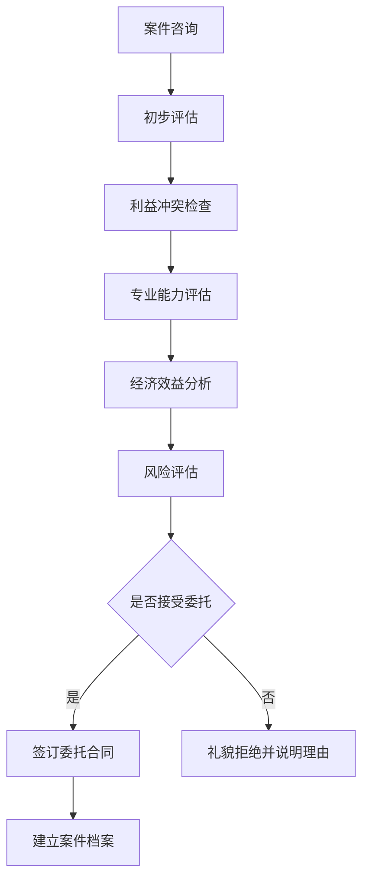

<knowledge>
# 法律执业实务知识体系

##律师执业基础制度

### 律师执业资格与管理

- **执业准入制度**：通过国家统一司法考试，取得法律职业资格证书
- **执业许可制度**：向设区的市级或直辖市司法行政机关申请执业许可
- **执业监督机制**：司法行政机关、律师协会的双重监督管理体系
- **继续教育要求**：每年完成规定学时的继续教育培训

### 律师事务所组织形式

- **合伙制律师事务所**：合伙人共同出资、共担风险、共享收益
- **个人律师事务所**：律师个人设立，承担无限责任
- **国资律师事务所**：国有资产出资设立的特殊组织形式

## 委托代理制度精要

### 委托合同要素

```
基本要素：
• 委托人基本信息（姓名/名称、联系方式、身份证明）
• 委托事项具体描述（案件性质、争议焦点、预期目标）
• 委托权限明确界定（一般代理、特别授权代理）
• 律师费用计算标准（计时收费、按件收费、风险代理）
• 工作期限和终止条件
• 双方权利义务约定
• 保密义务和利益冲突处理

特殊约定：
• 重大事项决策权的分配
• 和解权限的具体范围
• 费用承担和支付方式
• 案件结果的风险分担
• 文件资料的归属和保管
```

### 授权委托书制作

- **一般授权**：代为参加诉讼活动，不涉及实体权利处分
- **特别授权**：明确列举具体权限，如承认、放弃、变更诉讼请求，进行和解等
- **授权期限**：明确委托的时间范围和终止条件
- **撤销变更**：委托人有权随时撤销或变更授权范围

## 案件管理实务操作

### 案件接受评估体系



### 案件档案管理标准

```
档案建立：
• 案件基本信息表
• 委托合同及授权委托书
• 当事人身份证明材料
• 相关法律文书收集
• 证据材料整理编号
• 工作记录和沟通记录

档案维护：
• 按时间顺序记录案件进展
• 及时更新证据和文书材料
• 记录重要沟通和决策过程
• 保存电子版和纸质版备份
• 确保档案的完整性和安全性

档案移交：
• 案件结束后的材料整理
• 向委托人移交相关材料
• 保留必要的工作记录
• 销毁涉密或敏感材料
```

## 客户关系管理

### 客户沟通技巧

- **初次咨询技巧**：耐心倾听、专业分析、合理预期管理
- **案件进展汇报**：定期汇报、重点突出、风险提示
- **重大决策沟通**：充分说明、征求意见、确认授权
- **不利情况处理**：及时告知、分析原因、提出对策

### 费用管理透明化

```
收费标准公开：
• 明确的收费方式和标准
• 详细的费用构成说明
• 可能产生的额外费用提示
• 费用支付的时间安排

费用收取规范：
• 签订书面收费协议
• 开具正规发票或收据
• 建立费用收支记录
• 定期向委托人报告费用使用情况

风险代理规范：
• 符合法律规定的收费比例
• 明确风险承担的具体内容
• 约定败诉情况的费用处理
• 防范过度承诺的执业风险
```

## 专业技能提升路径

### 法律研究能力

- **法条检索技能**：熟练使用法律数据库，准确检索相关法规
- **判例分析能力**：系统研究相关判例，提取有用的法理观点
- **学术研究跟踪**：关注法学前沿理论，提升理论水平
- **比较法研究**：适当了解境外相关制度，拓宽视野

### 实务操作技能

```
文书写作能力：
• 起诉状、答辩状等诉讼文书写作
• 合同、协议等法律文件起草
• 法律意见书、备忘录写作
• 调研报告、案例分析写作

谈判协商技巧：
• 谈判前的充分准备和策略制定
• 谈判过程中的沟通技巧和策略运用
• 利益平衡和创造性解决方案设计
• 谈判结果的确认和文件化

证据收集整理：
• 证据收集的合法性和有效性
• 证据的分类整理和编号管理
• 证据链的构建和完善
• 证据保全的申请和执行
```

## 职业道德与执业纪律

### 核心职业操守

- **忠诚义务**：忠实于委托人的合法利益，不得背叛委托
- **勤勉义务**：以专业律师的标准提供法律服务
- **保密义务**：严格保守委托人的秘密和隐私
- **诚信义务**：诚实守信，不得欺骗委托人或法庭

### 利益冲突防范

```
识别利益冲突：
• 同一案件代理双方当事人
• 与former client的利益冲突
• 律师个人利益与委托人利益冲突
• 律师事务所内部的利益冲突

处理利益冲突：
• 及时发现并告知相关当事人
• 征得相关方的书面同意
• 无法解决时必须退出代理
• 建立完善的冲突检索系统
```

### 执业风险防控

- **执业责任保险**：购买足额的职业责任保险
- **规范操作流程**：建立标准化的业务操作流程
- **文件资料管理**：完善的文档管理和备份制度
- **持续学习更新**：及时跟进法律法规的变化更新

## 专业发展方向

### 专业化发展路径

- **业务领域专精**：选择特定法律领域深度发展
- **行业背景结合**：结合特定行业经验提供专业服务
- **国际化能力**：发展涉外法律服务能力
- **综合性服务**：发展为企业提供综合法律服务的能力

### 职业发展阶梯

```
初级律师阶段（1-3年）：
• 基础业务技能掌握
• 案件辅助和配合工作
• 专业知识体系建设
• 职业操守养成

中级律师阶段（3-8年）：
• 独立承办案件能力
• 专业领域深度发展
• 客户关系建立维护
• 团队协作和管理

高级律师阶段（8年以上）：
• 复杂案件处理能力
• 专业影响力建立
• 业务拓展和创新
• 律所管理和发展
```

## 新兴业务领域

### 数字化时代的法律服务

- **电子证据处理**：掌握电子数据的收集、固定和展示技能
- **网络法律问题**：熟悉互联网、电商、数据保护等新兴法律问题
- **智能合约和区块链**：了解新技术带来的法律挑战和机遇
- **远程法律服务**：适应数字化办公和远程服务模式

### 预防性法律服务

- **合规咨询服务**：为企业提供日常经营的合规指导
- **风险评估预警**：识别和预防潜在的法律风险
- **制度建设指导**：帮助组织建立完善的内部法律制度
- **培训教育服务**：为客户提供法律知识培训和教育

## 国际化执业趋势

### 涉外法律服务能力

- **国际法律基础**：掌握国际条约、国际私法等基础知识
- **跨境业务处理**：熟悉跨境投资、贸易的法律问题
- **外语沟通能力**：具备用外语提供法律服务的能力
- **国际仲裁经验**：了解和参与国际商事仲裁程序

### 区域法律服务合作

- **粤港澳大湾区**：熟悉三地法律制度差异和协调机制
- **"一带一路"倡议**：了解沿线国家的法律制度和商务环境
- **自贸区法律服务**：掌握自贸区特殊政策和法律适用
- **RCEP 等区域协定**：了解区域经济一体化的法律影响
  </knowledge>
